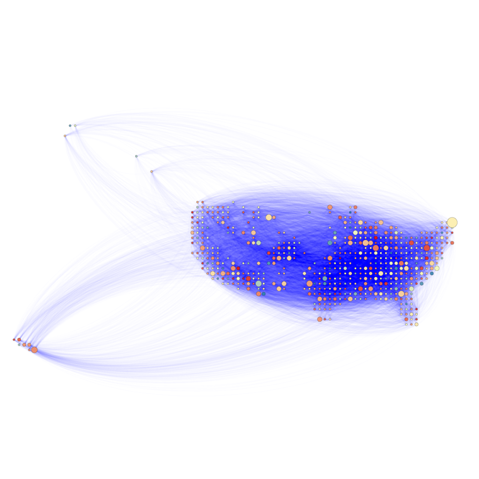
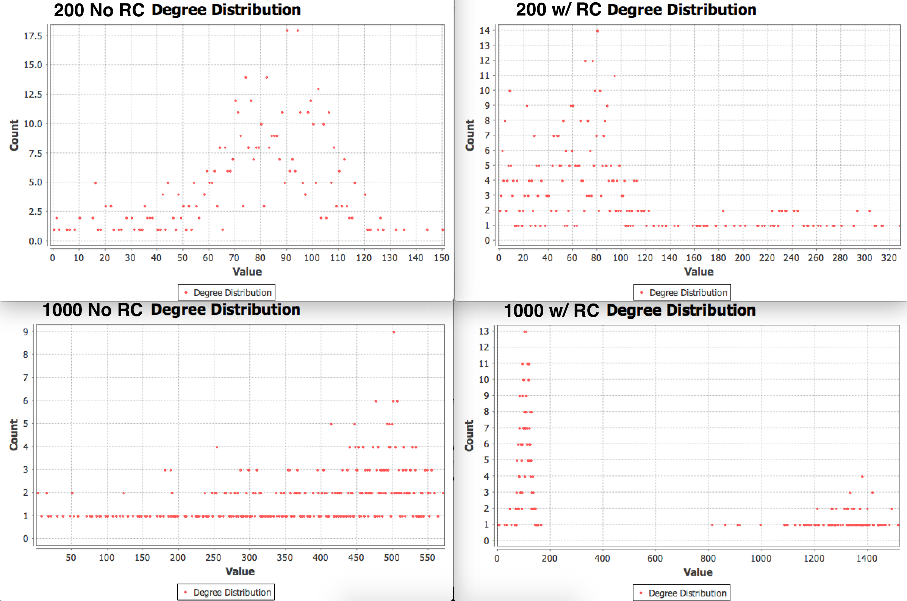

# Agent-Based Model for Housing Policy

*Devon Zuegel ([devonz@stanford.edu](mailto:devonz@stanford.edu)) & John Luttig ([jluttig@stanford.edu](mailto:jluttig@stanford.edu))*

## Introduction ##

San Francisco and the greater Bay Area have a troublesome history when it comes to rent control, housing shortages, and zoning laws. At a micro level, we have a fairly good understanding of how individuals make economic decisions such as where tenants choose to live and how much rent landlords choose to charge. However, we lack tools to model the complex interactions of millions of individuals –– landlords and tenants alike –– simultaneously making decisions. The emergent phenomena resulting from these simultaneous decisions can be very difficult to predict, because they are dependent on so many individual factors, and a slight change in just one can completely change the equilibrium.

Our work aims to provide a tool for policymakers and stakeholders to better understand these interactions that in aggregate comprise the housing market. Understanding large-scale systems requires understanding how the results of individual actions can be more than the sum of its parts. We used Agent-Based Modeling (ABM) to simulate the actions and interactions of tenants and landlords. ABM is a new and increasingly-popular tool within the social sciences that enables researchers to see the emergent properties of various networks over time and how tweaking various parameters affects these outcomes.

## Relevant Prior Work ##

**Agent­-based modeling: Methods and techniques for simulating human system
**[pnas.org/content/99/suppl_3/7280.full.pdf?sid=9c72ddfc­e9c9­4690­800e­b94ccae13a70](http://www.pnas.org/content/99/suppl_3/7280.full.pdf?sid=9c72ddfc%ADe9c9%AD4690%AD800e%ADb94ccae13a70)

Agent-based modeling: Methods and techniques for simulating human system by Eric Bonabeau is a paper published in The National Academy of Sciences that details agent­-based modeling’s features and design specifications. The paper directly relates to the class content, as it details techniques for a methodology introduced in class. It not only explains what agent­-based modeling is, but also provides examples in which the method is effective; in particular, in simulations involving flow, markets, organizations, and diffusion.

**Using Adaptive Agent-­Based Simulation Models to Assist Planners in Policy Development: The Case of Rent Control
**[santafe.edu/research/working­papers/abstract/0cbe9b4e0fc8061589e453dea9f772e/](http://www.santafe.edu/research/working%C2%ADpapers/abstract/0cbe9b4e0fc8061589e453dea9f772e/)

Using Adaptive Agent-­Based Simulation Models to Assist Planners in Policy Development: The Case of Rent Control is a paper published by Robert N. Bernard. It pushes for the use of agent-­based simulation in policy decision making. Its unique methodology involves demonstrating the simple and practical nature of using agent­-based simulations with real examples of rent control. The key technical content of the paper is the setup and analysis of an agent­-based simulation of rent control given factors of rent decontrol, “vacancy rates, apartment quality, tenant income, and average rent paid.” Bernard explains the probabilistic algorithms for each parameter and throughout the simulation in depth. As mentioned above, the focus on agent­-based models in both the class and the application of the methodology in the paper make this a relevant piece of research for the project.

**Reflection on Prior Work**

Both papers focus on the agent-­based modeling methodology. Whereas Bonabeau focuses on the modeling algorithm itself and several general use cases, Bernard goes into depth on a single use case – rent control – to inform readers of the usefulness of agent­-based modeling. The technical content of Bernard’s paper is significantly more comprehensive, whereas Bonabeau appeals to the general reader with little exposure to agent­-based modeling. Both authors have the goal of promoting agent­-based modeling, but Bonabeau promotes it as generally useful, while Bernard explores its usefulness in a specific vertical – policy planning.

Given the shortcomings in both papers – but notably in the Bernard paper – there is significant room to build on the papers above, and the nascent field of agent-­based modeling. One of the most promising questions in the field of agent­-based simulations is how it can be used in simulations that are tangentially related to rent control, using parameters including zoning laws, building height control, and tenant income levels. These parameters can be built into an easily navigable interface for the non­technical policy planners to test hypotheses about the future of housing in San Francisco and other cities. The specific implementation of the agent­-based modeling algorithm from Bernard’s paper could be modified by making total months an adjustable parameter, which would correct one of the shortcomings mentioned in the critique section above. The dataset could be expanded to other cities, but also other parameters within the same city – for example, by examining the dataset produced only by rent-­stabilized apartments. Given the expansion in publicly available datasets and computational power since 1999 when Bernard’s paper was published, there is a goldmine of opportunity in widening the scope of the research performed by Bernard and Bonabeau.

## Model & Algorithms ##

### Mathematical Background

For our project, there are several mathematical and computational background requirements to fully understand the research:

* Adjacency Matrices
* Agent-based modeling
* AgentScript framework
* Basic understanding of betweenness and closeness centrality measures
* Central Limit Theorem (randomized parameter inputs)
* Eigenvector centrality
* Average Degree Distribution

Using the agent-based model structure, we can port several of our algorithms that we learned in class to the structure used for our project.

For example, we modeled our data in a traditional adjacency matrix, letting each adjacency represent the level of preference to be close to each other (assuming reciprocity). This means that we can now use traditional algorithms from class to analyze our graphs, given each node represents a person entering a housing agreement. In the second part of our project, we used the algorithms described in Abhijit Banerjee’s paper from class to determine the most central hubs of rental contracts in the housing market; i.e. we can determine rent control “market-movers” based on friendships. Similarly, we performed algorithms to calculate eigenvector centrality, weighted degree distribution, and other key metrics across different populations and rent control tactics.


### Model

We built our model off a highly-customizable ABM framework called [AgentScript](http://agentscript.org/). Agentscript is a Coffeescript/Javascript implementation based on NetLogo agent semantics.

We represented the United States as a grid, where each patch is a single squared latitude-longitude degree initialized with the median home price of that zipcode. The data on these median home prices are from [Zillow](http://www.zillow.com/research/data/) and the zipcode latitude-longitude data are from [Boutell](http://www.boutell.com/zipcodes/). The darker the patch, the cheaper it is, while very light squares indicate a high home price.

We determined the cost and desirability of living on a given patch according to the following rules:

* `patch.desirability` is the sum of the following components:
    * The difference between the ideal population `@ideal_pop` and the actual population `p.turtlesHere().length` of that patch multiplied by the overpopulation cost constant `@overpop_cost_k` times `-1`.
    * The number of turtles of a random patch within the neighbor radius `random_nbr_patch.turtlesHere().length` times the neighbor coefficient `NBR_COEFFIC`.
* `patch.price` is determined by the following rules:
    * It is the sum of the following components:
        * The price at last tick `p.price`
        * `-1` times the overpopulation cost `@overpop_cost` times the difference between the ideal population `@ideal_pop` plus a random variable within the `+/-` range of the defined price variance `@price_var`.
    * The price cannot drop below `0`.
    * If the patch is governed by rent control, the price cannot go above the maximum price `@max_price`.

Here is the relevant Coffeescript snippet that encodes these rules into the model:

```coffee
n_turtles = p.turtlesHere().length
p.desirability = -@overpop_cost_k * Math.abs(@ideal_pop - n_turtles)

nbr_patches      = @patches.inRadius(p, @nbr_radius)
random_nbr_patch = nbr_patches[@random_num(nbr_patches.length - 1)]
p.desirability  += random_nbr_patch.turtlesHere().length * NBR_COEFFIC

p.price = Math.max(0, p.price - @overpop_cost_k * (@ideal_pop - n_turtles + @gaussian_approx(-@price_var, @price_var)))
p.price = Math.min(@max_price, p.price) **if** p.rent_control
```

The tenants (symbolized by the little stick figures) were initialized in random positions on the land patches. Tenants are orange when they are on rent-controlled patches; otherwise they are painted white. We determined their happiness or “utility” for being on any particular patch as a function of that patch. In particular, it is a sum of the following components:

* The desirability of that particular patch.
* `-1` times the price of that particular patch.
* A random variable within the `+/-` range of the defined turtle variance `@turtle_var`, which represents the variation of humans' preferences in the real world.

Here is the relevant Coffeescript snippet that encodes these rules into the model:

```coffee
patch_utility: (p, t) ->
    p.desirability - p.price - @distance_cost(p, t.p) + @random_num(-TURTLE_VAR, TURTLE_VAR)
```

The model relied on a wide set of parameters. You can find the full list below, including explanations of the role each one plays in our model:

```coffee
TURTLE_POP     = 200      # The number of turtles (tenants) in the model.*

TURTLE_VAR     = 100      # Range of variance within turtle preferences.*

PRICE_VAR      = 10       # Range of variance within prices.*

NBR_RADIUS     = 2        # The radius (in #s of patches) in which to count neighbors.*

NBR_COEFFIC    = 1        # How much to weight the number of neighbors.*

OVERPOP_COST   = 10000    # The coefficient that determines that importance of the number of turtles*
                          # sharing a given patch.*

DIST_COST      = 100      # The coefficient on the cost of moving far (which is a logarithmic*
                          # function on the distance of the move).*

DEFAULT_PRICE  = 188900   # We initialize patches in our ABM map with the average home values of the*
                          # corresponding zip codes. The data contained some irregularities, resulting*
                          # in "infinity" for some of these prices. To smooth out these irregularities,*
                          # we replace these values with the average home value across the entire USA,*
                          # which happens to be $188,900.*

MAX_PRICE      = 1000000  # The max price imposed by "rent control". This will start at the median*
                          # American home price.*

MAX_PATCH_POP  = 9        # Simulates height/density regulations (like those imposed in SF).*

IDEAL_POP      = 3        # The patch population at which the desirability of that patch is*
                          # maximized. If it is above this value, the patch loses value*

STABILITY      = 0.9894   # Each year, approximately 12% of American households move.*
                          # => census.gov/newsroom/press-releases/2015/cb15-47.html*

PROB_RENT_CONTROL = 0.2   # The probability that a given patch's price is restricted by rent-control.*
```

## Findings ##

| Population 200, without rent control  | Population 1000, without rent control  |
| :-:                                                                        | :-:                                                                          |
| **Population 200, with rent control**    | **Population 1000, with rent control**    |

| Weighted Degree Distributions:             |
| :-:                                        |
|  |

For each of the trials, we performed 10,000 iterations of our model to determine flow across the country and final population distribution. We found interesting differences in the statistics generated from each simulation. Anecdotally, while watching the simulations, we were surprised to find that that after several thousand iterations, the general population began migrating towards the east coast and south, and away from the northwest. Our explanation is that once a region has a sparse population, it becomes unattractive to prospective renters given the value of a basic level of community required to sustain living.

Figure 5 shows similar degree distributions for the two graphs with no rent control; similarly, the degree distributions for the simulations with rent control look roughly similar, each having two tails. However, the differences between no rent control and with rent control – holding population constant – show massive differences in the degree distributions, demonstrating and confirming our key hypothesis about the data. When rent control is in place, there is a sharp peak at a relatively low degree and a lesser peak at a high degree. We posit that this a direct result of the preference towards staying in rent-controlled areas, and the reluctance to leave them. In the distribution without rent control, on the other hands, the degree is approximately normally distributed which suggests that there is not a strong preference towards a specific type of housing.

Our graph nodes are colored from blue to red, where blue is low in-degree and red is high in-degree. Similarly, the node sizes are from 0.2 to 1.0, where 0.2 represents 1 turtle occupying that node at the end of the simulation, and a size of 1.0 represents the maximum number of turtles across any node in the graph. The node color emphasized the sparsely distributed flow in the simulation with rent control – particularly in Figures 3 and 4 – where there is a strong skew towards flow in a small number of nodes.

|                                 | Pop 200, w/o RC | Pop 200, w/ RC | Pop 1000, w/o RC | Pop 1000, w/ RC |
| -:                              | :-:             | :-:            | :-:              | :-:             |
| **Average Degree**              | 35.189          | 32.604         | 123.255          | 62.994          |
| **Average Weighted Degree**     | 39.719          | 39.597         | 196.589          | 193.923         |
| **Diameter**                    | 5               | 7              | 3                | 3               |
| **Avg. Clustering Coefficient** | 0.108           | 0.137          | 0.318            | 0.381           |
| **Edges**                       | 18756           | 17378          | 65695            | 33576           |
| **Nodes**                       | 533             | 533            | 533              | 533             |

Our algorithmic analysis points to an interesting fact about rent control in a large population: when rent control is enforced, the same total number of people move month-to-month, but between fewer places. This is made clear by the difference in average degree for columns D and E, but the similarity in their average weighted degree. Similarly, we can see from the number of edges in the rent-controlled large population that given a large enough population, rent control forces the population to move between fewer places, because tenants stay locked into rent-controlled areas and don't want to move. This is anecdotally true and reflects our model's effectiveness.