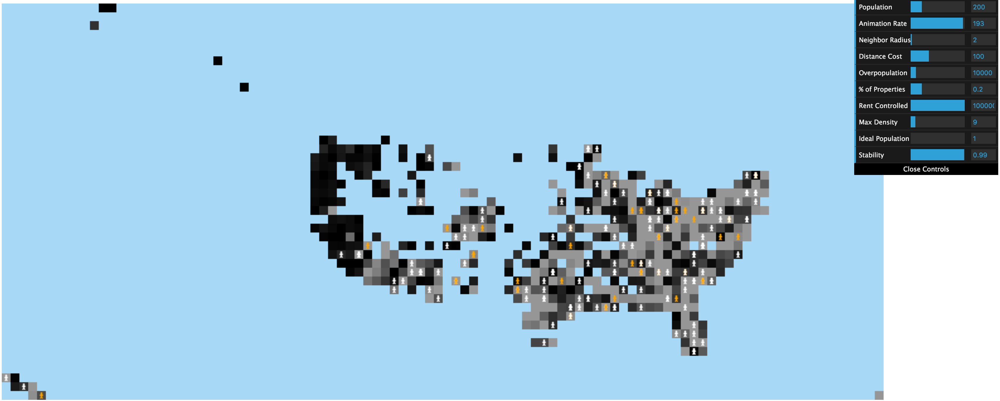
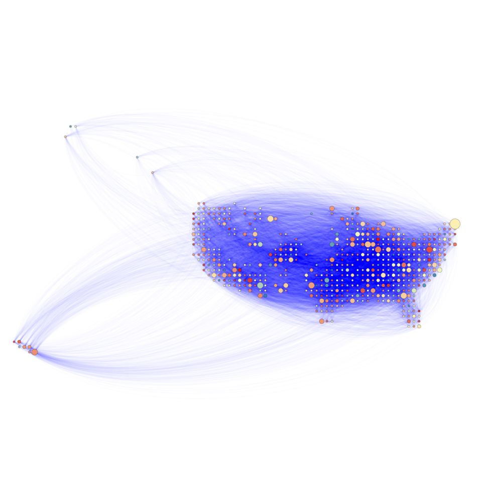
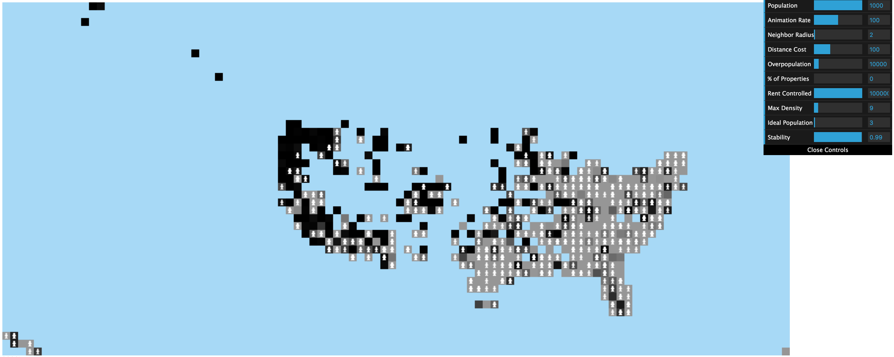
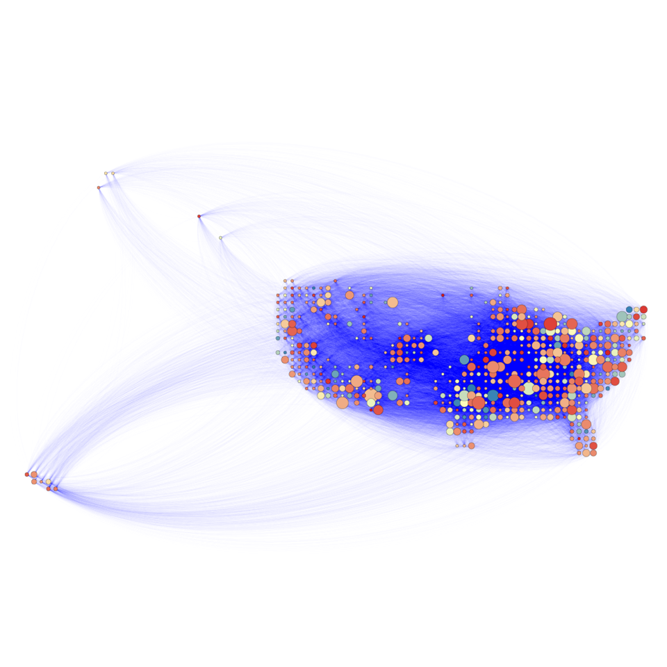
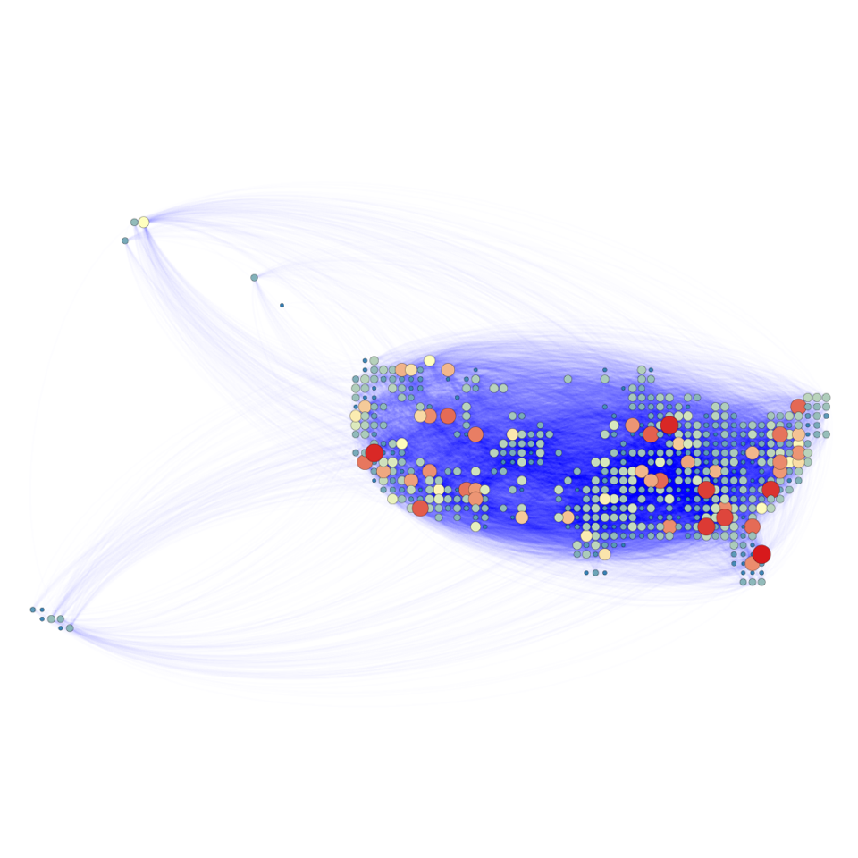
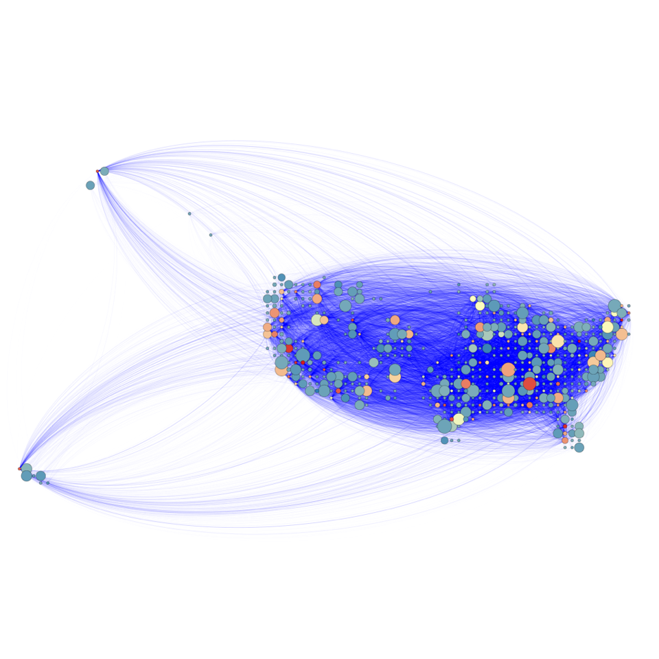
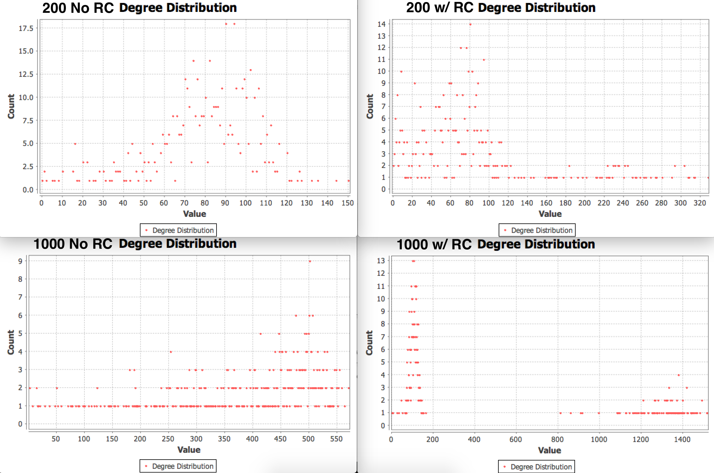

# Without Rent Control #

Population `200` after `10,000` iterations

Population `1000` after `10,000` iterations

# With Rent Control #

Population `200` after `10,000` iterations

Population `1000` after `10,000` iterations

# Degree distributions #

